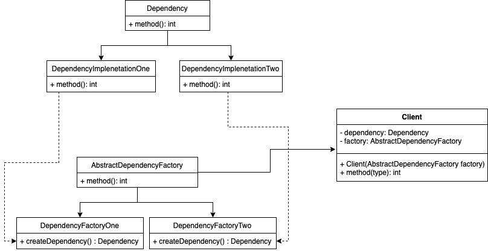
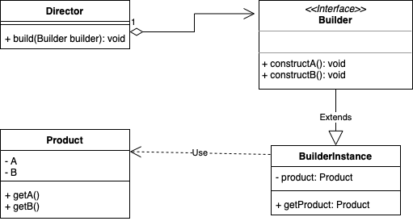

# Common Creational Patterns

1. [Abstract Factory](#abstract-factory)
2. [Builder](#builder)
3. [Factory Method](#factory-method)
4. [Prototype](#prototype)
5. [Singleton](#singleton)

## Abstract Factory

See below for a diagram of how Abstract Factory is structured

This pattern allows a user of a dependency (or set of dependencies) to 
remain unaware of the implementation of dependencies through the use of
a factory class.

The factory class implements some set of related dependencies, using some
set of implementations. The client then accesses those interfaces through
a factory. The Client is not concerned with the creation or implementation.

This isolated implementations, and makes exchanges of sets of implementations
easy, which helps to promote consistency.
The main disadvantage is that it is hard to extend a factory class, and every
new implementation requires a new sub-class of the factory.

## Builder

See below for a diagram of a typical Builder pattern

This pattern is used to construct many types from some starting type. Typically
used for composite types, and casting between them.

A use of this pattern is shown below:

>   `sut = new Director(5, 7);`\
    `sut.castToNewType(builder);`\
    `Product result = builder.getResult();`

This supplies a `Director` with a `Builder`, which the director then
instructs in some way to produce a result. When that process is complete,
the result can be accessed through the `getResult` method to yield a `Product`.

This separates construction code (in `Director`) and representation code (in `Product`
and `Builder` subclasses). We can easily add new representations, or change existing ones,
as well as varying details of construction in the Builder object.
This pattern is ideal for constructing _composite_ objects.

## Factory Method

## Prototype

## Singleton
